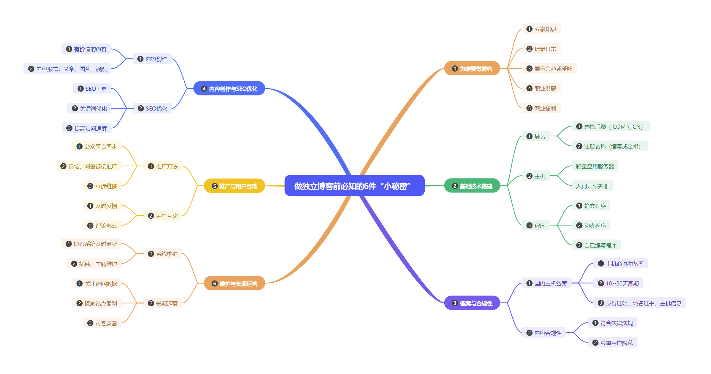

宝子们，虽然建议大家要做一个独立博客，但是也建议大家不要一股脑的扎进来。虽然独立博客不受公众平台管理自由度很高，但是也要弄明白一些事情，不要让一腔热血最终成了泡影，所以我们要先明白这6件事情，做出相应的选择后再来行动。

## 第一件事：搞清楚为啥要做博客

你为啥要做博客？是想靠着博客赚点小钱，还是想当“知识博主”分享自己的独门秘籍，还是想把博客当成自己的“情绪树洞”，还是想把博客当做记录生活的日记本，还是说想把博客打造成自己的第二分身？

知道自己在做什么，就好比我们事先知道自己的目的地在哪，不至于在路上七拐八拐不知前方是啥路途。这一点很重要，明白为啥要做博客，不至于陷入困惑时迷茫。

**我们常见的博客定位有以下几种：**

### 分享知识

将自己在某领域的专业知识、学习经验等分享出来，帮助他人解决问题，提升个人影响力，如技术博客分享编程知识、技巧等。

### 记录日常

记录生活点滴、感悟、成长历程等，留下个人记忆，也可以作为自我反思与总结的方式。也可以记录我们的兴趣和爱好，譬如今天买了一双适合跑步的全TPU科技跑鞋，写一写使用感受。又或者今天发现了宝藏骑行路线，拍一拍沿途风景，讲一讲骑行感受。

### 职业发展

展示个人能力和作品，增加个人在行业内的知名度，为职业发展提供助力，比如程序员通过博客展示自己的项目经验和技术实力。

### 商业盈利

通过博客吸引流量，实现广告投放、合作推广、电商带货等盈利模式，这需要博客有一定的流量和影响力。

## 第二件事：了解基础技术及搭建

这件事拒绝了大部分想做独立博客的宝子们，认为只有精通这些技术才能做得了独立博客，其实不然我们只需要了解域名、主机、程序就行，不需要达到精通。

域名就像我们的收货地址，可以通过域名找到我们的博客。主机像是我们的房子需要通电、门前有路，主机其实就是一台虚拟电脑可以叫服务器，价格高低取决于性能。程序像是客厅、餐厅、卧室、厨房、卫生间、阳台，当然我们可以按照自己喜欢的风格装修，博客程序就是内容和功能的载体。

### 域名选择

优先选择 `.COM` 等国际域名，当然`.CN` 也是不错的选择。当然也可以选择一些小众域名，但是为了更好的推广或接入其他服务还是选择主流域名比较好。

域名名称一定要简短容易被主机，建议与个人品牌或内容主题相关名称，可以是缩写也可以是全拼。我们也可以使用个性化简短域名，这样的域名更有个性。

### 主机与服务器

如果使用国内主机，需要申请ICP备案，虽然步骤繁琐，但是服务商会协助申请通过率很高。虽然备案后内容监管严格，但访问速度比较快，只要不是恶意违规，被管局或服务商打电话告知后及时纠正就行。当你看到违规内容，尤其是评论或友链一定要坚决删除，不要做事不管。

国外主机免ICP备案，很多人会选择国外主机。我发现很多常年在国外工作生活的中文博主，都会选择国外主机。不要认为国外主机就高枕无忧了，网站内容依然受控，那些被被墙的网站可能是违反规定或是被举报的结果。当然如果也要考虑访问速度，国内访问延迟过高，可能会错失很多国内用户。

新手推荐使用价格更优的轻量云服务器或者限购一台的云主机，目前阿里云、腾讯云都有新人优惠，即使买最便宜的云主机也完全够用，真的到了不够用的时候再升级也比较方便。

### 建站程序选择

程序是内容的载体，选择一个稳定、好用的博客程序可以使我们的博客走的更远。当然我们要根据自身来选择程序。如果你不是技术大佬建议使用常见的博客程序，这些程序往往有强大的社区，当你遇到问题时都比较容易解决。

#### 动态程序

动态程序只要一次部署，之后就可以使用后台进行管理内容，选择适合的插件和主题，很多功能不需要接触代码就能实现。目前常用的博客程序有`WordPress`、`Typecho`、`emlog`、`Z-Blog`、`Halo`。

新手推荐使用`WordPress`，虽然都说`WordPress`臃肿，其实是插件或主题臃肿，或是使用了国外服务，从而导致页面加载缓慢或压根加载不出来。

#### 静态程序

如果使用静态程序，也许你只需要买域名就行了。

常见的静态网站生成器有`Hexo`、`Hugo`。静态程序的优点很多，最大优点是使用GitHub Pages、Netlify等免费资源部署可以节省开支，当然也有人买云主机后私有部署。毕竟静态文件的加载速度十分快是动态程序难以相比的。

但是静态程序也有缺点，使用MarkDown编辑器，每次发布文章都需要Git提价数据，等待构建部署。新手不建议使用静态程序是因为部署比较繁琐，如果中间出错很难找到问题所在。

#### 自己编写程序

自己编写博客程序，数据技术进阶，总有一部分程序员会选择自己编写代码，尤其是全栈开发工程师。不仅仅需要前端技术，还需要后端技术以及数据库的使用。当然能达到这个水平的人不多。

## 第三件事：备案与合规性

### 国内主机备案

域名、主机都准备好之后可以申请备案了，如果你使用的是国内主机，这一步不可避免的。备案是为了规范互联网信息服务活动，维护国家安全和社会公共利益。备案需要一定时间，且备案期间网站需关闭。购买主机的服务商会提供备案支持，我们需要提供身份证明、域名信息、网站信息，通常需要10~20天审核周期。

### 内容合规性

无论你的博客站点是否备案，都应规避有风险的内容。而且写博客可不能想说啥就说啥，得遵守法律法规，不然一不小心就可能“翻车”，到时候哭都来不及。尽管如此，我们的自由度也比内容平台要高很多。

我们一定要受得住底线，遵守国家法律法规，不发布违法、违规、侵权等不良信息。同时，要注意保护用户隐私，遵守相关的隐私政策和数据保护法规。

## 第四件事：内容创作与SEO优化

内容是博客的核心，再好的内容也要SEO优化，搜索引擎能读懂的内容，才会推荐给适合的人。

### 内容创作

内容是博客的灵魂，再好看的博客没有内容空有一副好皮囊。你得绞尽脑汁写出有趣、有用、有深度的文章，让读者看了就像吃了巧克力一样开心。然而大部分时间，我们只需要坚持写，保持原创，保持更新让读者知道博客是活跃的。

博客内容不是一蹴而就，需要慢慢积累。内容可以是任意形式，常见的形式可以是文章、图片、视频等。要提供有价值、有深度、有独特见解的内容更容易被人订阅或收藏。

### SEO优化

SEO（Search Engine Optimization）即搜索引擎优化，通过优化博客的内容和结构，提高在搜索引擎中的排名。虽然SEO被内容平台弱化，但独立博客仍能从搜索引擎那里获取流量。

我们可以使用一些SEO工具，提交站点、文章到搜索引擎。管理好文章标题、内容、标签，优化内容关键词，创建好内部链接和外部链接。优化好SEO可以让更多人发现你的博客站点，如果你的站点访问速度很快，那么被用户收藏订阅的概率会大大提升。

## 第五件事：推广与用户互动

互联网之大无可想想，如今酒香也怕巷子深，把博客做好之后也要做一些推广和互动，尤其是刚开始做博客的时候。

### 推广大法

推广是为了让跟多人看到你的博客，访客越多留存用户才会多。

我们可以通过微博、微信公众号等平台同步内容吸引潜在用户，可以把博客站点当做私域。在知乎、豆瓣等平台回答相关问题并附博客链接，吸引同行关注。与其他博客、网站进行合作，互相推荐、交换链接等方式扩大影响力。

### 用户互动

要多和用户互动，人家留了言，你得热情回应，就像招待客人一样，这样才能留住读者的心。

及时回复读者的评论和留言，与读者建立良好的沟通和互动，了解他们的需求和反馈，不断改进博客内容和服务。可以设置评论区、留言板、问卷调查等互动功能。

## 第六件事：维护与长期运营

做博客是一件不大不小的事情，这件小事确是一件需要长期维护运营的事情。如果你的博客站点总是打不开，访问缓慢，内容没有更新，长此以往博客很快就会荒草丛生，读者自然就会消失了。

### 系统维护

无论使用的是静态博客还是动态博客，保障站点安全运行是第一要务。尤其是动态程序，更应该保持更新的习惯。害人之心不可有，防人之心不可无。不要下载来路不明的插件和主题，这时防止被挂马的关键。保持更新，可以防止黑客利用漏洞攻击。

如今我还保持着只使用有人维护和更新的插件主题，当用户反馈BUG和建议后，插件主题作者能及时反馈并解决。

### 长期运营

做博客可不是三天打鱼两天晒网的事儿，得长期坚持。

我们可以通过百度统计、Google Analytics监控网站访问数据，看看都是什么用户访问网站，他们关注那些内容，从中也能看到用户的一些习惯。虽然我不建议大家专门去讨好访客，但是了解访客能为博客站点提供用的运营方案。

我不排斥博客站点盈利，可以接入广告联盟，开设付费专栏，开启VIP用户专享。如果一个博客有收入，那这个博客站点将会更长久的运行下去。

但最终要重视内容运营，无论是发布的内容还是评论内容，都需要博主悉心运营。独立博客确实比较真实，因为这里没有算法，用户的反应也特别真实，评论内容极少会被水军影响。

宝子们，看完这6件事儿，是不是对做独立博客有了更清楚的认识？要是都准备好了，就行动起来吧，打造属于自己的博客小天地！
