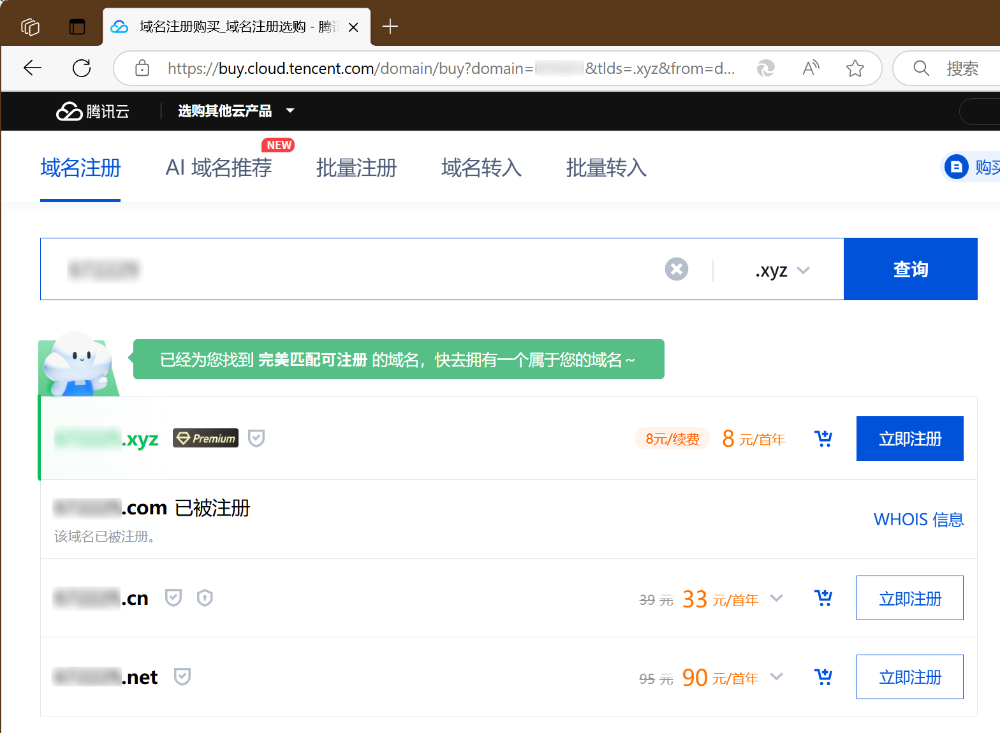

最近上网发现`.xyz`在搞事情，正常80多块的注册价格，却可以通过特别的方式8块钱拿下，而且续费也是8元/年。

## 免费域名的伤痛

搭建个人项目、个人网站、个人博客，域名是首先要考虑的。如果能白嫖一个域名自然是好的，但是目前靠谱的三大免费域名注册商都有不同程度门槛，注册成功的并不多。也许跟域名滥用有关吧，我们先不去讨论域名滥用的问题。

`EN.ORG`比较老牌的免费域名服务商，但是提交域名申请需要人工审核，周期通常长达1-2周，不一定能通过。`US.KG`免费域名，KYC验证步骤比较麻烦，看到长篇的教程望而却步。虽然`Freenom`提供如 `.tk`、`.ml` 等免费顶级域名，但实际申请成功率极低，且域名所有权归平台所有，平台可随时回收域名，用户无法转移或需要付费续期，长期投入可能瞬间归零。

## 8元/年顶级域名

对比免费域名，这样的顶级域名完全属于自己，可自主管理、转移、出售，无需担心审核或平台跑路。这么便宜的域名一次购买10年也就80块钱。

`.xyz`虽然不像`.com`那样广泛，作为新顶级域名使用人还是很多的。`.xyz`虽然是26个英文字母最后三位，从中文语境可以读作“`小宇宙`”，做个人项目也是比较好的。

目前各大域名服务商`.xyz`价格通常为80元/年，但是`.xyz`竟然有低价的`白金域名`。一直认为白金域名是溢价域名，没想到还有低价白金域名。

## 6位数字的.xyz顶级域名

既然是白金域名，对注册名称是有要求的。我们可以尝试使用不同的名称，来测试是否为低价白金域名。经过一番尝试，我发现**6位纯数字的.xyz域名，注册及续费价格是8元/年**，高于6位纯数字也是这个价格。

只能使用数字，不太好。不过我们可以**使用自己的生日、电话、QQ**号码来注册域名，这样就有了关联性。

**下图是腾讯云截图：**

腾讯云注册价格为8元/年，你可以尝试在阿里云或者其他注册商哪里试试，说不定会比8元/年更便宜。

注册一个6位数字的顶级域名，8元/年，续费同价，不香吗？这么便宜的域名，即使后期更换域名做跳转成本也是非常低的。
