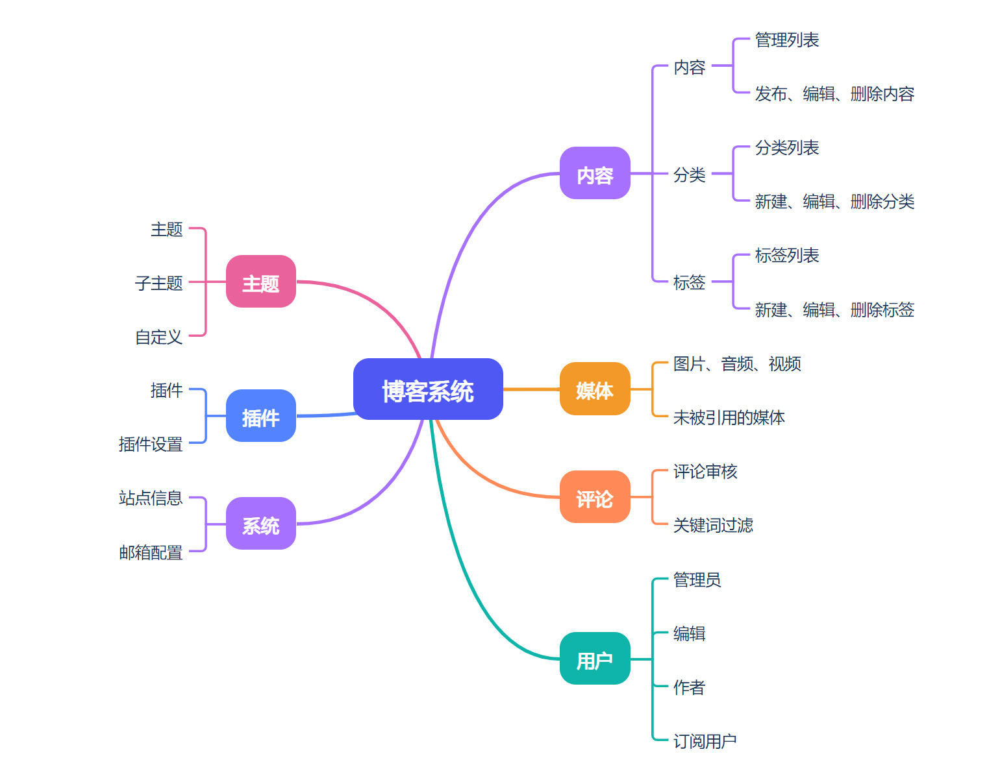

虽然一部分技术开发大佬有能力写一个适合自己的系统，但大多数博主只能选择现成的博客系统。我们常常在众多博客主题、插件之间找到平衡点，选择博客平台并希望通过主题、插件的扩展满足自己的需求。

想找一个完全符合自己需求的博客平台很难，就拿数百万网站使用的WordPress系统来说也存在很多不适用的问题。如果博客系统能够提供我们需要基本功能或扩展功能也能满足我们需求时，就可以选择这个博客系统。

接下来我们一起来探究成熟的博客系统应该有什么功能。

## 基础功能

### 内容管理

如今内容表现形式多种多样，有文章、图文、相册、音频、视频，甚至可以是一条简短的“说说”或是一张随手拍的照片。无论内容形式如何变化，内容是博客的灵魂。

#### 编辑器与内容发布

文章编辑器不像微软Office和WPS Office那般功能强大，但目前的编辑器功能已经能够满足我们的需求。设置文章标题、字号，插入图片、音频或是视频。

目前很多博客系统都集成了Markdown，不要看Markdown简单，实际功能比较丰富，扩展性强。还有一些博客采用经典富文本编辑器也能满足编辑需求。像WordPress的区块编辑器，争议比较大，已经习惯了经典编辑器的用户很难接受区块编辑。

但是按照目前趋势这种区块编辑器将会越来越受欢迎，因为区块编辑器不仅仅能够编辑文章，还能DIY博客页面，对于非程序大佬来说是一种最简单和直接的方式。

当然还有一些文章功能是需要的，譬如设置标题、内容描述、内容封面、发布日期，设置内容状态、分类和标签等等。

#### 媒体管理

图片、音频、视频，三大媒体已经是博客内容常见的形式，管理好媒体是博客必不可少的。但是作为博主，我们经常会忽略媒体管理，很少会点开媒体管理页面。

大部分博客系统在删除文章时不会删除引用的媒体文件，此时媒体文件一直存在会占用宝贵的服务器资源。当然默认输出引用媒体文件也是不友好的，也许有些媒体文件会在将来的某个内容被引用。比较好的媒体管理会显示该文件是否被引用，被哪篇文章引用等信息，这样我们就可以决定是否删除该媒体文件。

对于服务器环境来说，媒体文件的存储是非常重要的。有限的存储、网络资源致使我们不得不优化媒体文件，因此需要对图片、音频、视频进行压缩。

大部分博客系统提供webp图片压缩，原图、压缩图片都存储在服务器端，虽然增大了存储，但是节省了带宽客户端页面加载速度显著提升。但是大部分博客系统不提供音频、视频压缩功能，不是没有技术，而是这样的功能在执行压缩任务时十分占用服务器资源，也许会导致服务器宕机。我们可以将音频、视频在本地压缩好之后再上传。

#### 分类及标签

博客站点不像公众平台有算法推荐，分类和标签可以帮助访客快速找到想看的内容。通过使我们的博客是什么主题。摄影博客的分类或标签可能会有人像、风光、美食、扫街、天空、飞鸟、动物、相机、镜头、三脚架、闪光灯等等。

分类和标签相互配合，增强内容的关联性，这样就不必担心很久之前发布的内容埋没在历史的长河里。

### 用户权限管理

博客系统是多角色的，管理员、编辑、作者、订阅用户等等，我们赋予不同角色不同权限。

订阅用户：可以查看博客文章，可以发表评论。

作者：发布文章，管理自己文章的评论。

编辑：不仅可以发布管理自己的文章，还可以管理其他用户发布的文章及评论。

管理员：拥有博客后台最高权限，不仅可以管理内容，还可以安装更换主题、插件，设置站点信息等等。

大多数个人博客仅有一个用户，就是管理员用户，拥有最高权限不仅可以管理内容还可以管理博客主题、插件等等，这样比较方便，不用来回切换账号。大部分时候我们只需要管理博客内容，因此也有一些博主为了站点安全，常常使用编辑用户。

### 评论与互动

也许你很少看到博客站点的登录和注册按钮，我们照样可以发表评论。这是博客站点的开放评论，无需注册用户允许游客评论，在评论时提供邮箱、昵称就可以发表评论了。

为什么要提供邮箱，邮箱作为媒介，可以接收邮件，当你的评论被其他访客回复会收到邮件（需要博客系统支持），这样就可以知道他人的反馈。不过不需要担心邮箱被泄露，除了博主其他人看不到你的邮箱地址。

当然评论内容可能会有一些广告、违规、违法的内容，因此需要采取一些措施来防止这些内容产生。可以通过评论审核、内容过滤、人机识别验证等措施来防止垃圾评论。

除了评论互动，博客还可以通过RSS订阅、邮箱订阅等方式通知订阅用户，当我们发布文章时，订阅用户会收到相应的消息，可以增强订阅用户的粘性。

## 扩展功能

如果大家都是用博客默认功能，那么就脱离了独立博客的个性。扩展功能提供个性化支持，我们可以通过扩展增加新功能或是改变当前功能。

主题：可选风格样式，页面结构、配色、动画效果等等方面。当然主题也可以包含一些功能定制，这样可以使当前主题有更多变种不至于千篇一律。

插件：脱离主题的功能，不受主题影响。通过安装插件可以赋予博客更多功能，譬如友情链接系统，表单系统，投票系统，广告管理系统等等。

譬如我们可以通过插件控制RSS输出，把不想被订阅的文章隐藏起来。可以通过插件优化缓存，加快博客访问速度。可以通过SEO优化插件提高博客站点在搜索引擎的排名。

## 写在最后

一个优秀的独立博客系统不仅需要满足基本的博客功能，还需要在内容管理、用户体验、安全性和扩展性等方面做到全面优化。提供灵活的配置、强大的功能和良好的用户体验，帮助创作者更高效地分享内容，吸引更多的读者和互动。

无论是一个个人博客还是团队协作的平台，选择或开发一个功能完善的独立博客系统都是至关重要的。

祝你成功！

博客系统应该还有什么功能，一起畅想未来博客系统该有的样子。