Oracle免费云服务器资源已经有很长时间了，闲下来申请试试，看看Oracle云资源与国内大厂云服务器有什么区别，顺道还可以给网站安个家，岂不美哉。

但最终还是失败了，尝试多次同样的提示，感觉无缘Oracle免费云服务器了。不甘心的我提交了Oracle Customer Service，等待回复。

**以下是申请流程及截图，虽然没有申请成功，但步骤如此：**

申请地址：[https://www.oracle.com/cn/cloud/free/](https://www.oracle.com/cn/cloud/free/)

## 打开申请页面

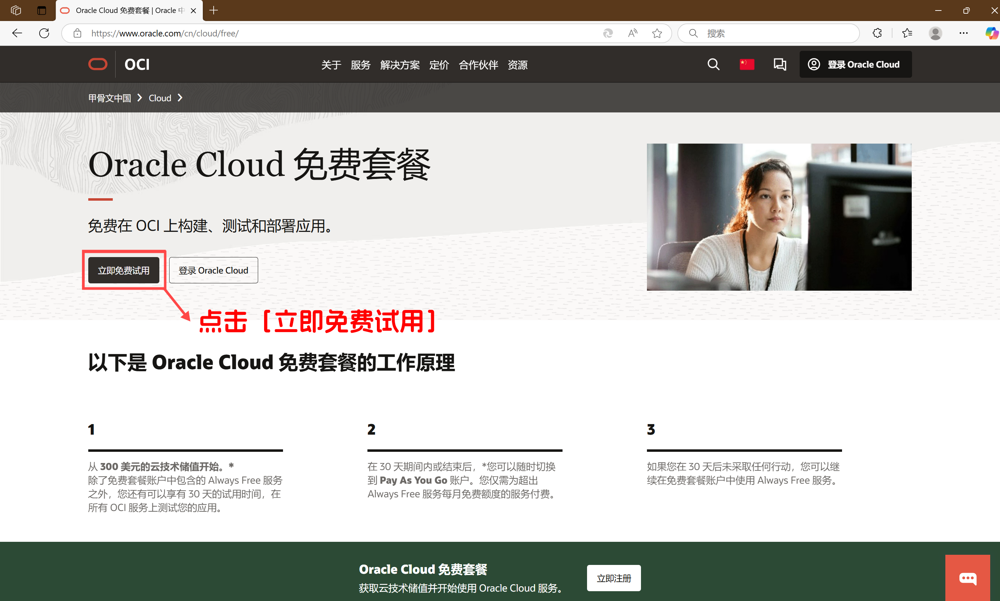

点击`立即免费试用`，开始注册。

## 填写账户信息

名字、姓氏、电子邮件，都如实填写。这里我采用了163邮箱，大部分教程推荐使用gmail邮箱，在我看来只要合规能收到邮件就行，而且163邮箱作为国内数一数二的服务商也是不错的。

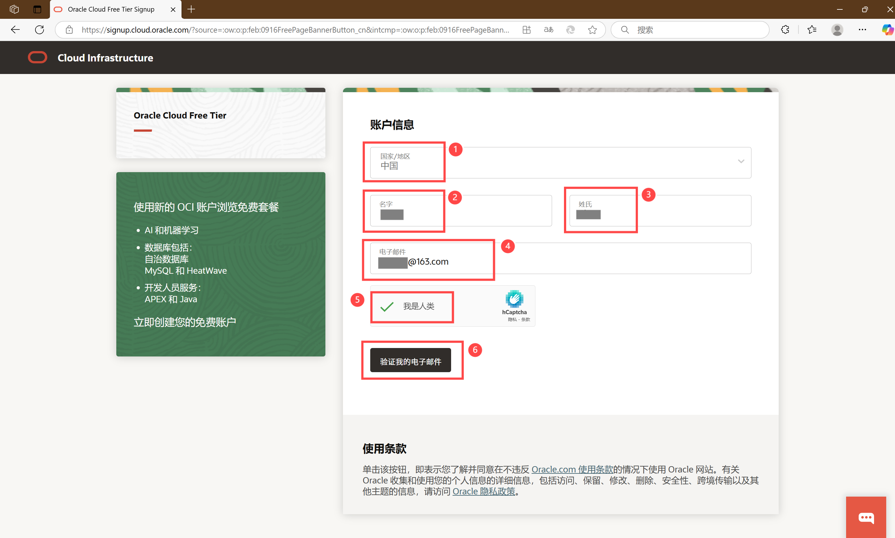

## 验证电子邮箱

点击邮件的`Verify email`按钮，进入下一步。

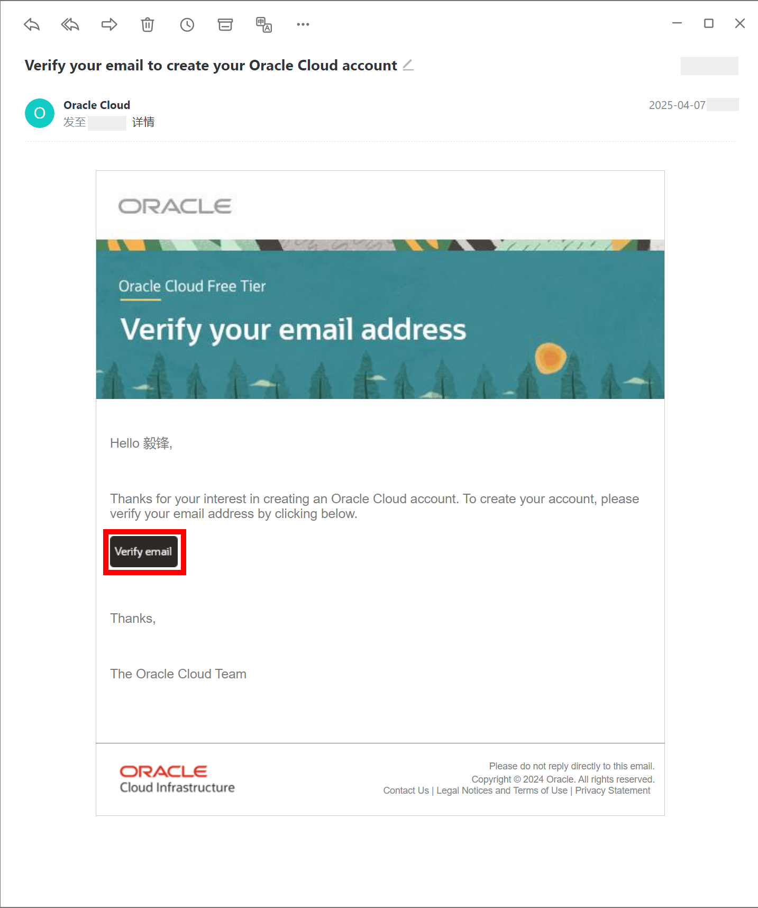

## 填写账户信息

继续填写账户信息，姓名、姓氏已经填写过了，这里需要完善备用名称，我使用了英文名，看其他教程有很多人使用拼音可以试试。

然后需要填入密码，账户类型选择`Individual`个人。

选择服务器主区域，由于提示韩国中部（首尔）和日本东部（东京）需求较高，为了能够更好的访问云服务器，我选了`Japan Central(Osaka)`日本中部（大阪）。

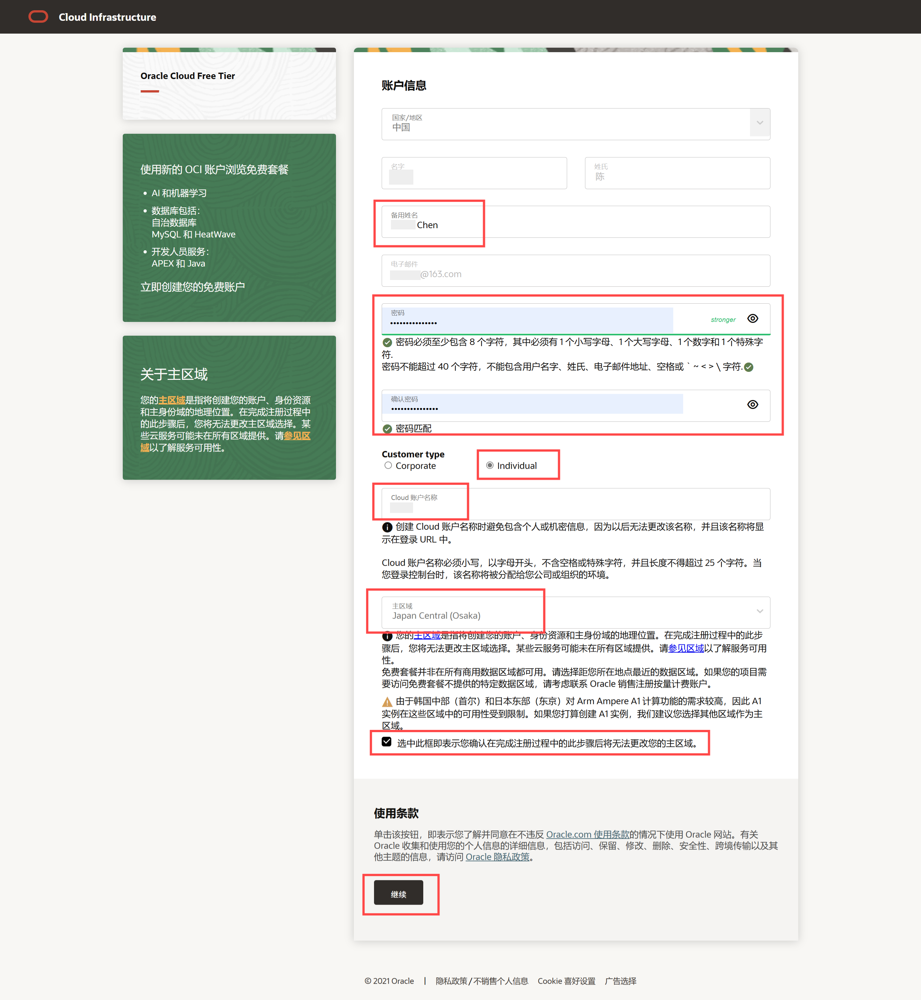

## 填写地址信息

这一步填写地址信息，不知道有啥要求，如实填写。地址行1填写街道门牌号详细信息，地址行2、3选填直接忽略了。

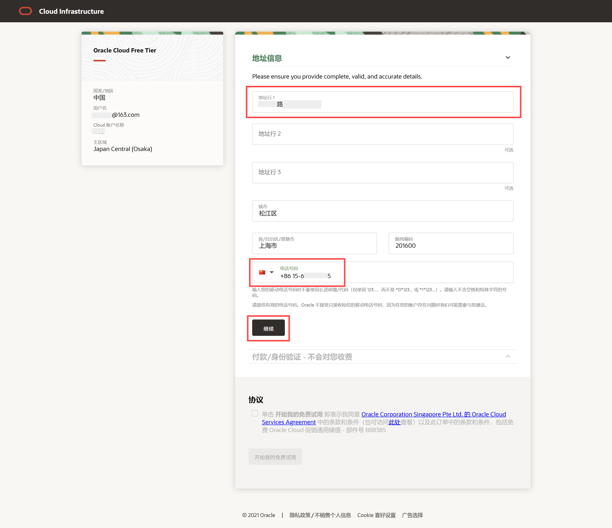

## 添加付款验证方式

付款验证，手里有VISA信用卡，刚好可以用来验证。验证付款卡片，虽然会有一笔小金额交易，不过系统会自动退款，金额原路返还，所以这一步是不花钱的只是验证。

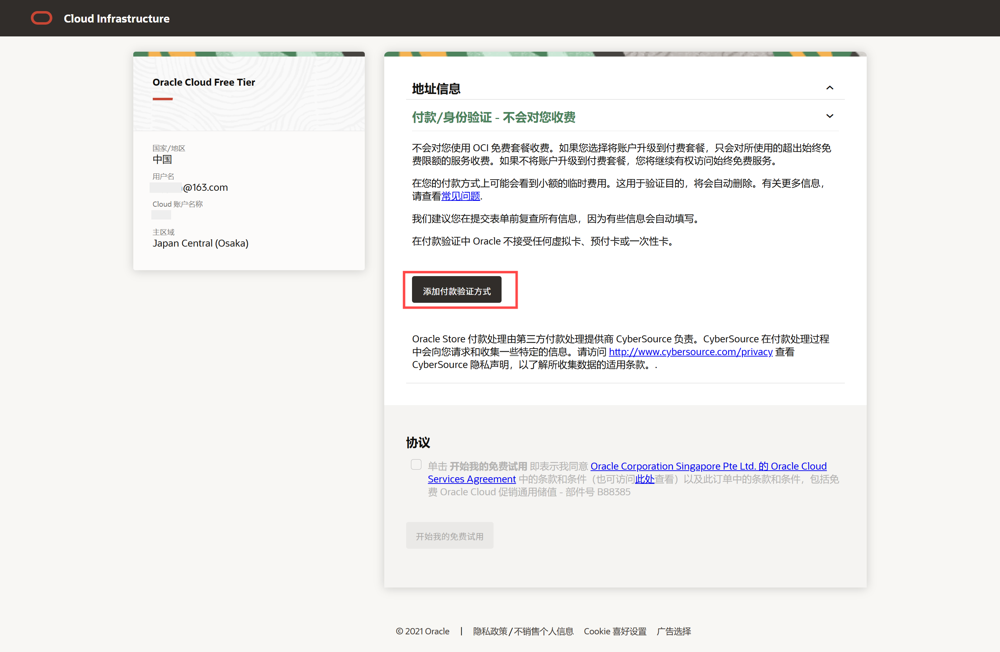

点击`添加付款验证方式`按钮。

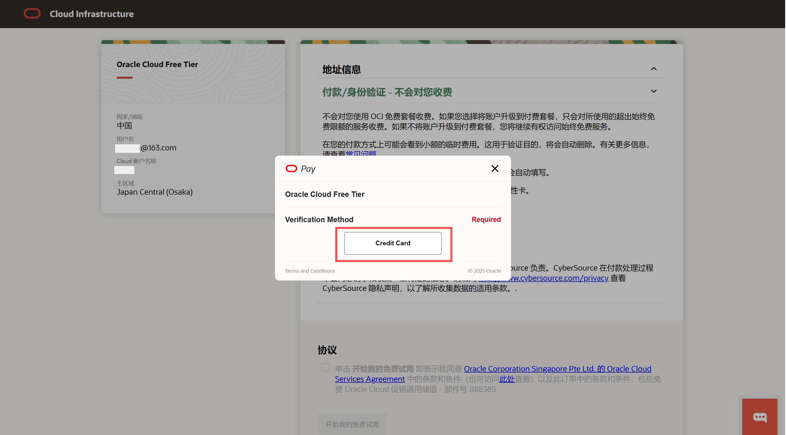

没得选，点击`Credit Card`按钮，验证信用卡片。

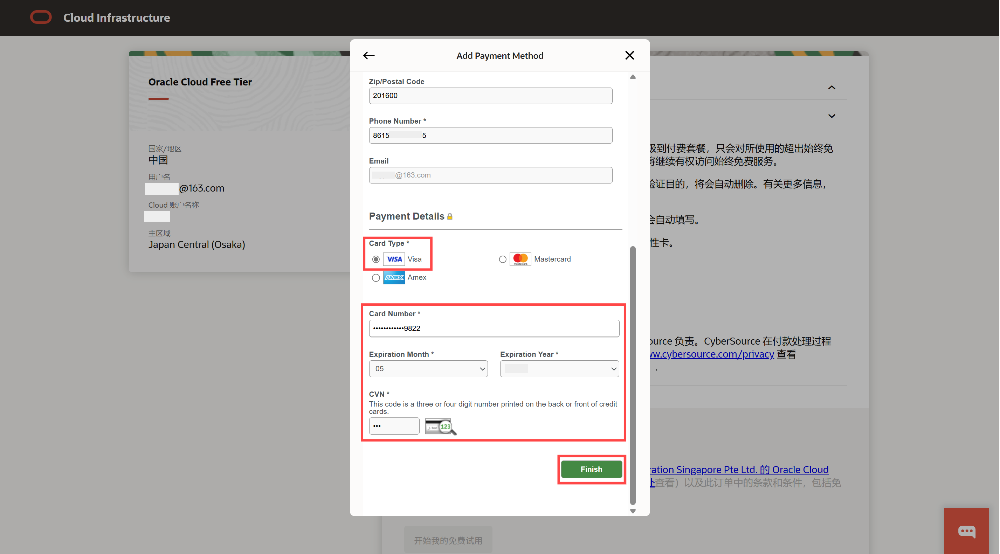

输入VISA卡信息后，点击`Finish`后，会收到交易短信，页面显示`Thank you!`表示卡验证完成。

交易完成后，系统自动退款，所以此步骤不会产生费用。

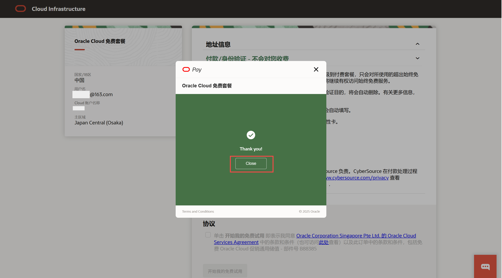

点击`Close`后会看到页面，有验证卡片的信息。

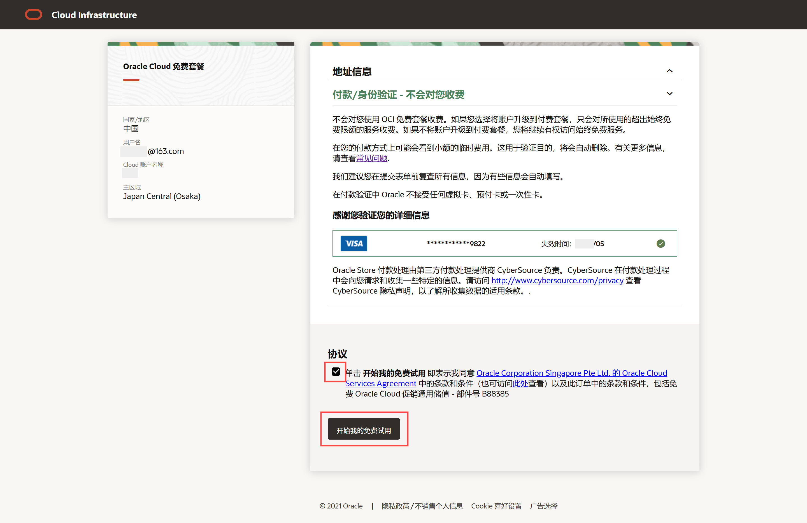

勾选协议，点击`开始免费试用`。

## 注册失败

接下来就凭运气的时刻了，如果成功会看到`正在为您设置账户，请稍后...`。

如果失败了，可能会和我一样看到`处理交易时出错`。

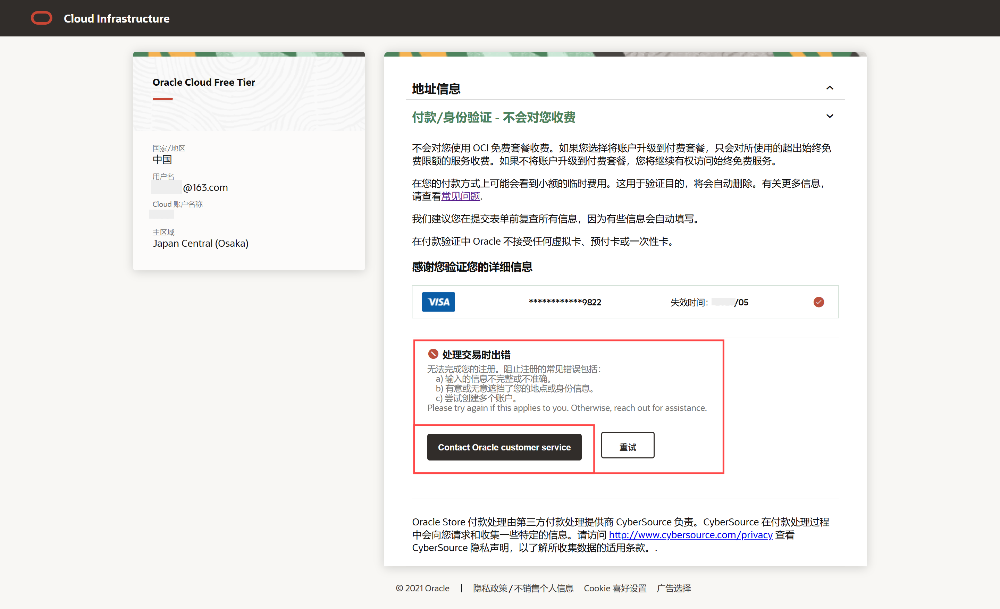

没想到竟然注册失败了，不服输的我毫不犹豫的点了`重试`，但最终还是同样的提示。到这里我基本已经放弃了，毕竟老外的资源想白嫖还是有一点水土不服。

看到左侧按钮，决定反馈试试，说不定管用，随后点击了`Contact Oracle customer service`按钮。

## 反馈信息

不死心的我点了`Contact Oracle customer service`按钮，提交注册遇到的问题，剩下就听天由命吧，希望能成功。

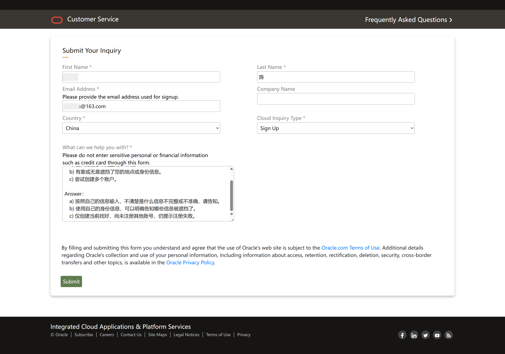

反馈邮件显示遇到等48小时，那就等吧。

> Your inquiry has been received. You should expect a response within 48 hours.

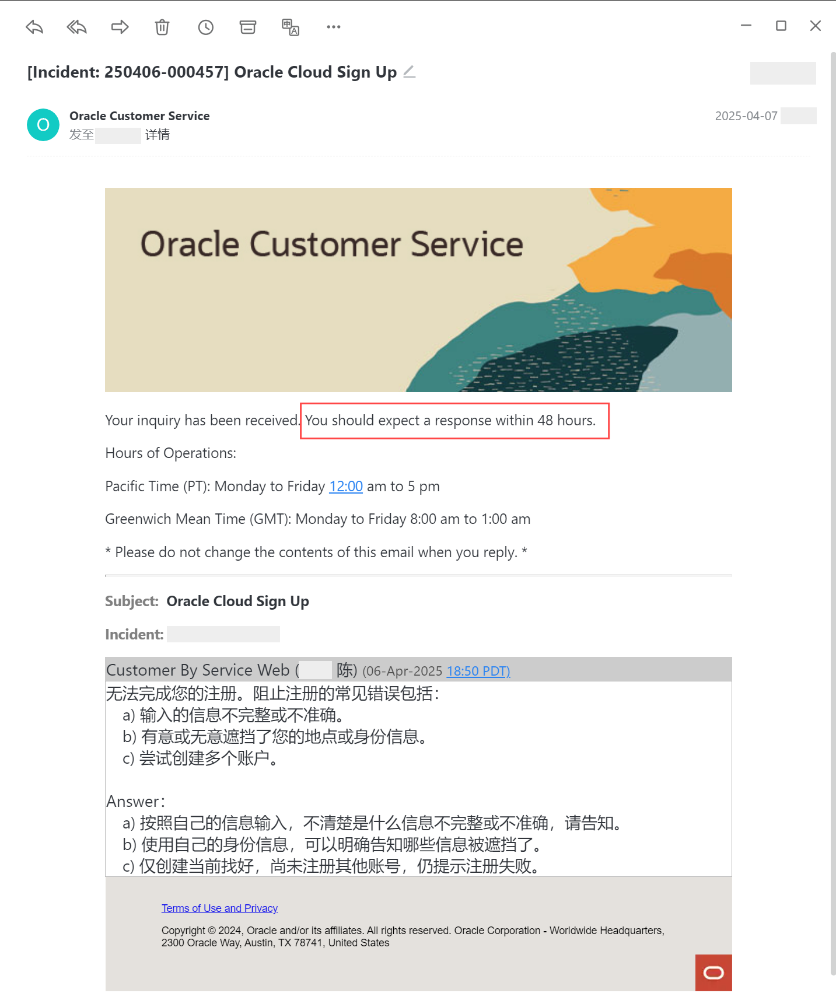

看到有博主说可以尝试更换注册信息，邮箱、手机号或是换个付款卡片试试。但是评论区却看到有人尝试了10多个账号信息依然是这个问题。

注册Oracle Cloud免费云服务器就像套圈，看上去简单实际上凭运气。虽然我提交了问题，但是能不能得到反馈还不知道，已经不想尝试重新注册了，静等48小时看看有没有回复。