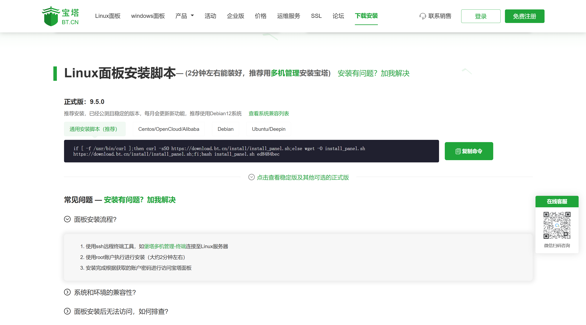

宝塔 Linux 面板安装比较简单，我们直接进入正题，使用 Ubuntu 24.04.2 安装宝塔 Linux 面板，其他 Linux 系统方法雷同，但要注意 Linux 系统版本，尽量使用推荐系统。

## 宝塔 Linux 面板安装要求

**内存**：512M以上，推荐768M以上（纯面板约占系统60M内存）

**硬盘**：300M以上可用硬盘空间（纯面板约占20M磁盘空间）

**系统**：Debian-12->Ubuntu-22->Centos9，确保是干净的操作系统，没有安装过其它环境带的Apache/Nginx/php/MySQL/pgsql/gitlab/java（已有环境不可安装）

**架构**：x86_64（主流服务器均是此架构），ARM不完整兼容（面板环境安装慢，部分软件可能安装不上）

## 获取宝塔面板安装脚本

访问宝塔面板下载页面：`https://www.bt.cn/new/download.html`

复制 Linux 面板安装脚本代码，推荐使用通用代码。

**Linux 通用安装脚本：**

```plain
if [ -f /usr/bin/curl ];then curl -sSO https://download.bt.cn/install/install_panel.sh;else wget -O install_panel.sh https://download.bt.cn/install/install_panel.sh;fi;bash install_panel.sh ed8484bec
```



## 执行宝塔面板安装脚本

确保当前 Linux 为 `root` 用户。

可使用 `sudo su root` 命令切换 root 用户。

粘贴安装脚本代码，回车执行。看到提示键入 `y`，继续安装。


等待安装结果：


安装成功后，会获得提示：`Congratulations! Installed successfully!`

记录面板管理地址 `https://114.92.163.255:22096/dda8f131`，并记录用户名 `username` 和密码 `password` 用于管理宝塔面板。

## 访问宝塔面板

访问记录的管理地址： `https://114.92.163.255:22096/dda8f131`

宝塔面板 WEB 管理地址组成：

| https          | 传输协议                                 |
| -------------- | ---------------------------------------- |
| 114.92.163.255 | 主机 IP                                  |
| 22096          | 面板端口（随机生成，需要记录，放行端口） |
| dda8f131       | 安全入口（随机生成，需要记录）           |

**注意：**有安全组的服务器（阿里云、腾讯云、华为云）需要**放行端口。**

面板端口、安全入口可以在宝塔面板`设置`->`常用设置`页面内更改。

**登录宝塔 Linux 面板**


**首次登录需要同意用户协议**


**首次登录需要绑定宝塔账号**


**绑定成功后，就可以通过在线面板管理服务器了。**


**我们可以根据自己的需要安装服务。**

## 写在最后

宝塔 Linux 面板安装步骤比较简单，所用时间并不长。虽然 Linux 服务器没有图形界面，大多数的我们对 Linux 命令不太熟悉，但是我想只要会复制粘贴命令就能管理好 Linux 主机。

以上内容参考宝塔教程：`https://www.bt.cn/bbs/thread-19376-1-1.html`