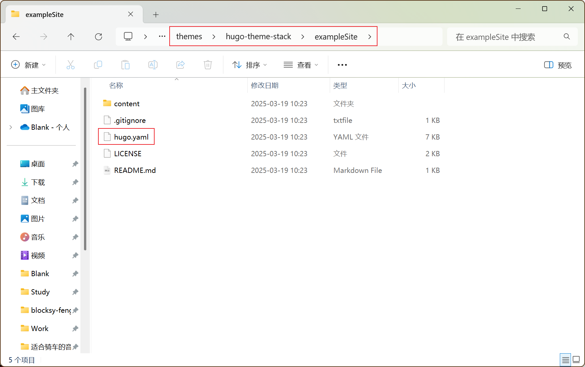

**（文内有彩蛋）**

大家好呀！宝子们！今天化身技术导游「代码特调师」，教大家用比瑞幸咖啡还便宜的成本（甚至免费），搭建一个高颜值个人博客。无需服务器、不用学编程，跟着步骤操作，30分钟就能拥有自己的互联网小天地~

30分钟对新手来说有点夸张，但是按照下面的步骤是可以免费撸一个独立博客的。

---

为什么选Hugo？

- **闪电速度：** 生成上千篇文章只需1秒，比外卖小哥送咖啡还快
- **零成本：** 所有工具免费，连域名都有薅羊毛技巧（见第08步，自定义域名）
- **高颜值：** 用上`hugo-theme-stack`主题，秒变极简风博主

---

**关键信息：**

本次实战系统为Window11，MacOS、Linux略有不同，但大同小异。

---

**操作流程：**

1. **安装Hugo环境：**
   需要安装Git、Go、Hugo
   难易程度：★☆☆☆☆
   虽然安装界面是英文，只需要点击`Next`，就OK了。
2. **创建本地站点：**
   使用Hugo创建站点，安装主题，本地开启Server服务。
   难易程度：★★★☆☆
   此步骤容易踩坑，譬如选择的主题没有zh-cn，主题配置比较麻烦；hugo配置文件后缀`.yaml`或`.toml`语法搞混。
   本次实战使用的Hugo主题：hugo-theme-stack，https://github.com/CaiJimmy/hugo-theme-stack
3. **GitHub自动部署：**
   注册GitHub，参考Hugo官方文档，按照步骤部署。
   难易程度：★★★★☆
   此步骤不仅要看Hugo英文文档，还要学会使用Git命令。需要注意的是，GitHub大多时候国内网络打不开或访问很慢，需要使用海外的VPN服务。

**下面是具体的图文操作步骤，希望对你有所帮助。**

------

## 01. 安装Git：给你的代码找个管家

👉 **操作指南**

1. ### 下载Git

   打开Git官网，点击「Download for Windows」

   Git官网：https://git-scm.com/
   下载页面：https://git-scm.com/downloads/win

2. ### 安装Git 

   双击安装包，全程无脑点「Next」。

3. ### 验证安装

   开始 → 命令提示符 → 输入 `git version`，出现版本号即成功

**小贴士**：Git就像代码界的「美团外卖」，能把你的博客打包送到GitHub仓库

**相关截图：**


Windows命令▲

------

## 02. 安装Go：Hugo的超级引擎

👉 **操作指南**

1. ### 下载Go

   访问Go官网下载Windows版（约100MB）

   Go官网：https://go.dev/
   下载页面：https://go.dev/doc/install

2. ### 安装Go

   双击安装包，默认路径一路「Next」。

3. ### 验证安装

   开始 → 命令提示符 → 输入 `go version`，出现版本号说明引擎到位

**避坑指南**：如果报错，请重启电脑让环境变量生效（别问，问就是玄学）

**相关截图：**


Windows命令▲

------

## 03. 安装Hugo：你的博客生成器

👉 **操作指南**

参考文档：https://gohugo.io/installation/windows/ 

你可以选择自己喜欢的安装方式，本次实战使用的是「winget」的安装方式。

1. ### 安装Hugo

   开始 → 命令提示符 → 输入 `winget install Hugo.Hugo.Extended`，等待程序自动下载自动安装。

2. ### 验证安装

   安装结束后，命令提示符输入`hugo version`，看到版本号，你的博客生成器安装完成啦。

**小贴士：** **为什么选Extended版？** 就像奶茶要加奶盖，有些主题需要额外功能支持

**相关截图：**


Windows命令▲

------

## 04. 创建站点：给你的博客圈地

👉 **操作指南**

参考文档：https://gohugo.io/getting-started/quick-start/

1. ### 规划博客站点本地路径

   任意位置新建文件夹 `wwwroot`，右键选择「在终端打开」。

   `wwwroot`文件夹是为了方便站点管理，也许你会创还能很多个网站用来试手。

2. ### 创建本地站点

   创建本地站点，输入命令：`hugo new site bokeyanjiushe`，执行魔法咒语

3. ### 进入站点根目录

   进入博客站点根目录，输入命令：`cd bokeyanjiushe`，执行魔法咒语

4. ### 启动Hugo

   启动Hugo服务，输入命令：`hugo server`，执行魔法咒语。

5. ### 查看效果

   打开站点：使用浏览器打开：「http://localhost:1313/」页面显示“Page Not Found”，无需担心，因为还没有添加内容。

**至此你已经成功完成了本地站点的创建，你可以看看博客根目录里的文件，熟悉一下目录结构。**


此时你的博客目录结构长这样：

   ```
myblog/  
├── archetypes/  
├── content/  		# 内容文件夹
├── themes/  		# 主题文件夹
└── hugo.toml      	# hugo配置文件
   ```

**比喻时刻**：这就像在电脑里划出一块地皮，准备盖房子啦！

**相关截图：**


Windows命令▲


成功访问本地博客站点▲


博客站点目录▲

---

## 05. 安装主题：给你的博客穿新衣

👉 **操作指南**

参考文档：https://gohugo.io/getting-started/quick-start/

主题Demo：https://demo.stack.jimmycai.com/

1. ### 进入站点根目录

   进入站点根目录：Windows资源管理器找到博客根目录，右键选择「在终端打开」。

2. ### 初始化Git仓库

   初始化本地站点Git仓库，在打开的终端输入命令：`git init`，执行魔法咒语。

3. ### 安装Hugo主题

   安装Hugo主题「stack」，输入命令：

   ```
   git submodule add https://github.com/CaiJimmy/hugo-theme-stack.git themes/hugo-theme-stack
   ```

   ***注：**如果打不开GitHub，需要先启动海外VPN服务。*

4. ### 复制Hugo配置文件

   复制主题用例的`hugo.yaml`文件到博客根目录，需删除原有hugo配置文件`bokeyanjiushe/hugo.taml`。

   将`bokeyanjiushe/themes/hugo-theme-stack/exampleSite/hugo.yaml`复制到博客根目录`bokeyanjiushe/hugo.yaml`

5. ### 修改Hugo配置文件

   修改Hugo配置文件：`bokeyanjiushe/hugo.yaml`，使用记事本打开该文件，采用 `Ctrl` + `F` 的方式快速找到修改位置。

   修改语言：`languageCode: zh-cn`

   修改站点名称：`title: 博客研究社` 

   修改默认语言：`DefaultContentLanguage: zh-cn`

   修改字符集支持：`hasCJKLanguage: true`

   修改多语言支持：不需要多语言，可以在前面加`# ` 注释掉，或者直接删除该段配置信息。

   ```
   # languages:
   #     en:
   #         languageName: English
   #         title: Example Site
   #         weight: 1
   #         params:
   #             sidebar:
   #                 subtitle: Example description
   #     zh-cn:
   #         languageName: 中文
   #         title: 演示站点
   #         weight: 2
   #         params:
   #             sidebar:
   #                 subtitle: 演示说明
   #     ar:
   #         languageName: عربي
   #         languagedirection: rtl
   #         title: موقع تجريبي
   #         weight: 3
   #         params:
   #             sidebar:
   #                 subtitle: وصف تجريبي
   ```

   

6. ### 启动预览

   Windows资源管理器找到博客根目录，右键选择「在终端打开」。

   输入命令`hugo server -D` ，构建静态文件并启动服务。

   服务启动成功后，浏览器打开`http://localhost:1313`，看到极简风界面即成功！

［*至此你已经完成本地部署并成功安装了主题，恭喜你距离成功又进一步。*］

**主题彩蛋**：按 `Ctrl+C` 停止服务，修改配置后实时刷新可见，无需再次启动服务。

**相关截图：**


安装主题▲



主题用例文件夹▲


先复制hugo配置文件，再修改配置信息▲


构建静态文件并启动hugo服务▲


本地主题页面效果▲

---

## 06. 发布文章：写下你的第一杯「代码咖啡」

👉 **操作指南**

可以参考主题用例：`bokeyanjiushe\themes\hugo-theme-stack\exampleSite\content\post`

文章前置信息参考hugo文档：https://gohugo.io/content-management/front-matter/

文章前置信息参考主题文档：https://stack.jimmycai.com/writing/frontmatter

1. ### 打开内容目录

   ```
   bokeyanjiushe\content\
   ```

2. ### 新建文章存储文件夹「`post`」

   ```
   bokeyanjiushe\content\post\
   ```

3. ### 新建文章内容文件夹

   新建文章内容文件夹：`1_hello-bloger`，方便区分文章：

   ```
   bokeyanjiushe\content\post\1_hello-bloger\
   ```

4. ### 新建文章index.md

   在文章文件夹内新建`index.md`文件：

   ```
   bokeyanjiushe\content\post\1_hello-bloger\index.md
   ```

5. ### 编辑文章index.md

   用记事本或Markdown编辑器打开新建的`index.md`，开始编写第一篇文章吧。

6. ### 文章前置信息

   前置信息，可参考hugo文档或主题文档。下面是一个例子，仅供参考。

   ```
   ---
   title: 你好博主，你好博客研究社。
   description: 博主你好，欢迎来到博客研究社。助力博客发展，为思考点赞。
   date: 2024-03-18 13:12:11
   slug: hello-bloger-hello-bokeyanjiushe
   image: cover.jpg
   categories:
       - 动态
   ---
   ```

7. ### 文章正文内容

   前置信息后面是正文内容，使用Markdown编写，可以借助Markdown应用编辑。

   index.md

   ```
   ---
   title: 你好博主，你好博客研究社。
   description: 博主你好，欢迎来到博客研究社。助力博客发展，为思考点赞。
   date: 2024-03-18 13:12:11
   slug: hello-bloger-hello-bokeyanjiushe
   image: cover.jpg
   categories:
       - 动态
   ---
   
   **亲爱的博主：**
   
   当你点开这篇文章时，或许正坐在深夜的屏幕前，指尖敲击着尚未完成的草稿；或许刚刚按下“发布”键，看着文字化作数据流中的微小光点；又或许只是偶然路过，在浩瀚的信息宇宙中与这片文字相遇——无论如何，欢迎来到博客研究社。这里没有算法制造的流量泡沫，只有文字与文字之间真诚的共振。
   
   在短视频如同着急上班打卡的流星般划过时代上空时，个人独立博客像星际尘埃历经磨合，终于凝聚成的星辰。每颗星球都有自己的运行轨迹：有人记录代码世界的奇思妙想，就像厨师记录私房菜谱；有人搭建哲学迷宫的思维导图，如同建筑师绘制蓝图；有人绘制生活碎片的诗意光谱，恰似画家在调色盘上涂抹灵感。我们不需要成为恒星，吸引行星环绕，甘愿做静谧发光的孤星，在彼此的引力场中构建思想的星座。当算法推送的流行曲目成为时代的背景噪音，这些散落在私人服务器里的文字，正编织着互联网最初的浪漫叙事。
   
   快餐式内容如同太空垃圾般充斥轨道时，博客始终是漂浮在数据海洋中的诺亚方舟。我们固执地保留着超链接的锚点，像在信息洪流中抛下的船锚；用长文对抗140字的碎片速食，就像用一本厚厚的书对抗几片薯片，用深度思考的压强对抗流量至上的真空。当无数人在社交媒体的引力井里下坠，如同被漩涡卷入深海，博客作者们依然保持着太空漫步般的优雅姿态——这里没有即时热榜的灼热，只有思想冷却后沉淀的结晶体，就像清晨草叶上的露珠，纯净而美好。
   
   那些说“博客已死”的人或许不懂，真正的文字拥有量子纠缠般的魔力。某篇三年前的影评可能在某个失眠夜拯救灵魂，就像一首老歌在某个雨夜突然治愈心情；五年前的代码笔记或许正在培养皿中悄然孕育新项目，如同一颗种子在土壤中慢慢发芽；十年前的情感札记说不定会在平行时空引发蝴蝶效应，就像一句无意间的话在多年后改变某个人的选择。我们用超链接构建的星系，正以光年为单位持续扩散，每一个字都是时空胶囊，等待被未来的目光重新激活。
   
   此刻，当你在个人域名的小行星上敲打键盘，请记住：在银河系的另一侧，无数个独立服务器正亮着相似的微光。我们或许永远无法成为月活过亿的超级应用，但正是这些散落的星辰，标记着人类思考的坐标。让我们继续书写吧，在算法的黑暗森林里守护文字的篝火，在注意力稀缺的宇宙中做永恒的追光者，就像在喧嚣的城市中守护一盏温暖的夜灯。
   
   你好，亲爱的博客作者。愿星辰不灭，愿思考永续。
   
   *以上内容由AI生成*
   ```

8. ### 构建静态文件启动Hugo服务

   博客根目录，右键点击「在终端打开」，执行命令`hugo server -D`，浏览器访问`http://localhost:1313`就能看到刚才发布的文章了。

**写作技巧**：支持Markdown语法，插入代码、图片、表情包都很方便。

本地部署及发布已经完成，接下来就要与连接互联网了。后面的教程为GitHub自动部署，跟着做就好。

**相关截图：**


Markdown编辑器▲


本地浏览效果▲

------

## 07. GitHub Pages部署：把博客挂到云端

👉 **操作指南**

需要注册GitHub账号，这里就不讲账号如何注册了，如果GitHub无法访问可尝试使用海外VPN进行访问。

参考文档：https://gohugo.io/host-and-deploy/host-on-github-pages/

1. ### GitHub新建仓库

   仓库名与用户名保持一致，当然也可以不保持一致，之后可以自定义域名来绑定自己的域名。

   `用户名.github.io`（例如 `we-x.github.io`）

   `用户名.github.io/仓库名`（例如 `we-x.github.io/we-x`）

   **相关截图：**

   

   在GitHub新建仓库▲

2. ### 使用Git推送本地文件到GitHub

   使用执行**Git命令**的方式 **或** **GitHub Desktop 可视化操作**。

   #### 方式一、**Git命令推动本地代码（新手不建议）：**

   在博客根目录下右键点击「Open Git Bash here」，依次输入命令：

   ```
   git commit -m "first commit"
   ```

   ```
   git branch -M main
   ```

   ```
   git remote add origin https://github.com/we-x/we-x.git
   ```

   ```
   git push -u origin main
   ```

   #### 方式二、**GitHub Desktop推送本地代码：**

   下载并安装：GitHub Desktop

   https://github.com/apps/desktop

   使用GitHub先commit 再 Fetch origin

   注意：如果本地站点与GitHub仓库名称不一致，在本地博客根目录上右键点击「在终端打开」，行执行下面的命令，修改GitHub仓库地址。

   ```
   git remote add origin https://github.com/we-x/we-x.git
   ```

   **相关截图：**

   

   GitHub Desktop界面▲

3. ### 修改GitHub Pages构建部署方式

   使用浏览器访问你的GitHub仓库：仓库菜单`Settings` > `Pages`，`Build and deployment` > `Source` 修改为`GitHub Actions`

   **相关截图：**

   

4. ### 更改本地图片缓存路径

   编辑本地博客站点根目录的配置文件：`bokeyanjiushe\hugo.yaml`，在配置文件末尾添加以下代码。

   ```
   caches:
     images:
       dir: :cacheDir/images
   ```

5. ### 创建workflows

   执行配置文件的路径：`.github` \ `workflows` \ `hugo.yaml`

   **创建详情：**

   本地博客站点根目录下新建文件夹及配置文件：`bokeyanjiushe\.github\workflows\hugo.yaml`

6. ### 修改刚新建的hogo.yaml

   本地文件路径：`bokeyanjiushe\.github\workflows\hugo.yaml`

   将以下代码复制到该文件，按需修改仓库分支名称：`branches`及Hugo版本：`HUGO_VERSION`配置。

   如果你的远程仓库分支为`main`无需修改`branches`。

   如果你的Hugo版本为`0.145.0`也无需修改`HUGO_VERSION`。

   下面的代码来自官方文档：https://gohugo.io/host-and-deploy/host-on-github-pages/#step-7

   ```
   # Sample workflow for building and deploying a Hugo site to GitHub Pages
   name: Deploy Hugo site to Pages
   
   on:
     # Runs on pushes targeting the default branch
     push:
       branches:
         - main
   
     # Allows you to run this workflow manually from the Actions tab
     workflow_dispatch:
   
   # Sets permissions of the GITHUB_TOKEN to allow deployment to GitHub Pages
   permissions:
     contents: read
     pages: write
     id-token: write
   
   # Allow only one concurrent deployment, skipping runs queued between the run in-progress and latest queued.
   # However, do NOT cancel in-progress runs as we want to allow these production deployments to complete.
   concurrency:
     group: "pages"
     cancel-in-progress: false
   
   # Default to bash
   defaults:
     run:
       shell: bash
   
   jobs:
     # Build job
     build:
       runs-on: ubuntu-latest
       env:
         HUGO_VERSION: 0.145.0
         HUGO_ENVIRONMENT: production
         TZ: America/Los_Angeles
       steps:
         - name: Install Hugo CLI
           run: |
             wget -O ${{ runner.temp }}/hugo.deb https://github.com/gohugoio/hugo/releases/download/v${HUGO_VERSION}/hugo_extended_${HUGO_VERSION}_linux-amd64.deb \
             && sudo dpkg -i ${{ runner.temp }}/hugo.deb
         - name: Install Dart Sass
           run: sudo snap install dart-sass
         - name: Checkout
           uses: actions/checkout@v4
           with:
             submodules: recursive
             fetch-depth: 0
         - name: Setup Pages
           id: pages
           uses: actions/configure-pages@v5
         - name: Install Node.js dependencies
           run: "[[ -f package-lock.json || -f npm-shrinkwrap.json ]] && npm ci || true"
         - name: Cache Restore
           id: cache-restore
           uses: actions/cache/restore@v4
           with:
             path: |
               ${{ runner.temp }}/hugo_cache
             key: hugo-${{ github.run_id }}
             restore-keys:
               hugo-
         - name: Build with Hugo
           run: |
             hugo \
               --gc \
               --minify \
               --baseURL "${{ steps.pages.outputs.base_url }}/" \
               --cacheDir "${{ runner.temp }}/hugo_cache"
         - name: Cache Save
           id: cache-save
           uses: actions/cache/save@v4
           with:
             path: |
               ${{ runner.temp }}/hugo_cache
             key: ${{ steps.cache-restore.outputs.cache-primary-key }}
         - name: Upload artifact
           uses: actions/upload-pages-artifact@v3
           with:
             path: ./public
   
     # Deployment job
     deploy:
       environment:
         name: github-pages
         url: ${{ steps.deployment.outputs.page_url }}
       runs-on: ubuntu-latest
       needs: build
       steps:
         - name: Deploy to GitHub Pages
           id: deployment
           uses: actions/deploy-pages@v4
   ```

   

7. ### 推送更改信息到GitHub仓库

   #### 方式一、GitHub Desktop

   

   #### 方式二、Git命令

   ```
   git add -A
   git commit -m "Create hugo.yaml"
   git push
   ```

8. ### 查看workflows的工作状态

   本地更改文件Git推送后，查看GitHub Actions状态：`GitHub仓库` > `Actions` 。

   完成构建和部署您的网站后，状态指示器的颜色会变为绿色。

   **相关截图：**

   

   

   构建成功后的状态▲

   

   构建详情▲

9. 查看效果

   访问 `https://用户名.github.io/仓库名`，你的独立博客已上线！

   `https://we-x.github.io/we-x/`，下一步绑定自己的域名，绑定后GitHub提供的域名将失效。

**自动部署彩蛋**：用GitHub Actions可实现「写文章→自动发布」

［*到此为止您已经拥有一个可以在互联网上看到的个人独立博客了。*］

------

## 08. 自定义域名：给你的博客起个洋气名字

👉 **薅羊毛指南**

1. ### 购买域名

   **［彩蛋］**阿里云新用户注册购买`.cn` \ `.com` 首年免费，`.xin` \ `.top` 首年只要1元。

   **［彩蛋］**免费域名：Freenom（https://www.freenom.com/）提供免费域名服务，后缀有：`.TK` / `.ML` / `.GA` / `.CF` / `.GQ`。

2. ### GitHub设置自定义域名

   GitHub仓库`Settings` > `Pages` 找到自定义域名`Custom domain`，填入自己的域名并保存`Save`。

   **相关截图：**

   

   自定义域名▲

3. ### 配置DNS解析

   有两种方式，第一种添加A记录，第二种添加AAAA记录。

   #### 方式一、添加A记录，记录值如下

   ```
   185.199.108.153
   185.199.109.153
   185.199.110.153
   185.199.111.153
   ```

   添加A记录：`www → 185.199.108.153`（GitHub Pages的IP）

   #### 方式二、添加AAAA记录，记录值如下

   ```
   2606:50c0:8000::153
   2606:50c0:8001::153
   2606:50c0:8002::153
   2606:50c0:8003::153
   ```

   添加AAAA记录：`www → 2606:50c0:8000::153`

   等待域名DNS解析生效，就能使用专属域名访问你的独立博客了。

5. ### 更改hugo配置信息

   记事本打开博客根目录下的配置文件：`bokeyanjiushe\hugo.yaml`

   修改配置`baseurl`配置为您的自定义域名：`baseurl: http://www.boke360.cn/`

   修改后使用GitHub Desktop提交并推送更改的文件。

6. ### 访问自定义域名看看效果吧

   Tips：DNS生效后仍打不开，请重启浏览器后再试。

   http://www.boke360.cn

   上线后效果截图：

   

------

## 09. 咖啡时间：你可能遇到的问题

❓ **Hugo server报错**
→ 检查主题是否安装正确，参考主题文档

❓ **GitHub Pages显示404**
→ 确认仓库名是 `用户名.github.io`，GitHub仓库是否上传完成。

❓ **域名无法访问**
→ 用dnschecker.org检查DNS解析状态

------

**［彩蛋］**：如果使用免费域名，1分钱都不用花，瑞幸咖啡还要9块9。
